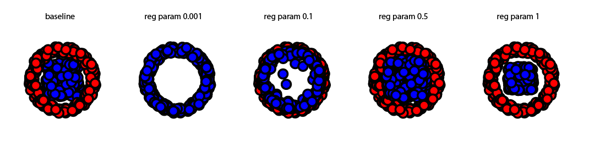

# ot_da_matlab
 Optimal Transport based Domain Adaptation in Matlab

Implements a basic unsupervised domain adaptation methodology using the excellent work by Gaberial Pyre here: https://github.com/gpeyre/2017-MCOM-unbalanced-ot  
*** requires the matlab code from above link on your matlab path.

